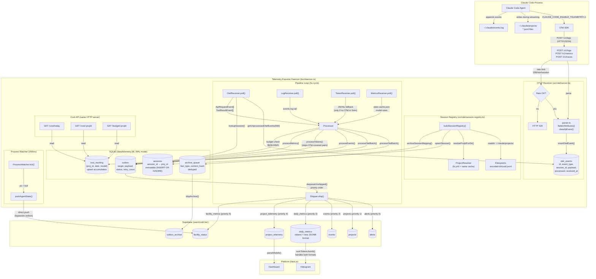
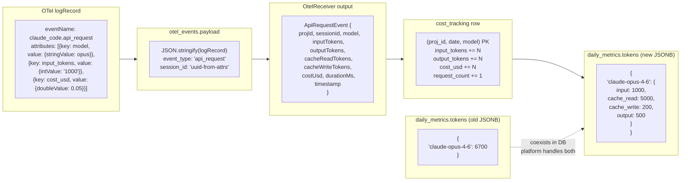
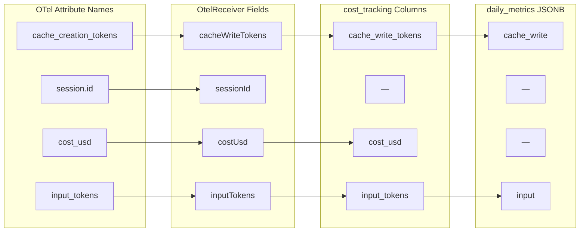

# OTel Telemetry Data Flow

Reference diagram for the telemetry exporter pipeline. Read this when modifying any stage of the data flow to understand upstream/downstream dependencies.

## End-to-End Pipeline

## Data Format at Each Stage

## Key Field Mappings

## Facility Status (UI Signal Only)

The daemon is always on. `facility_status.status` in Supabase is a UI signal for Next.js:
- `lo-open` sets it to `active` (green dot on platform)
- `lo-close` sets it to `dormant` (grey dot on platform)
- Auto-dormant after 2h with no active Claude agents

The daemon does not read or care about this field. It always processes and ships.
